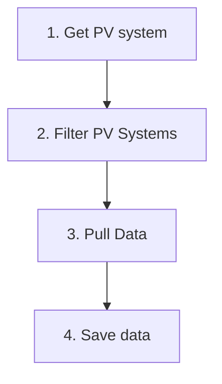
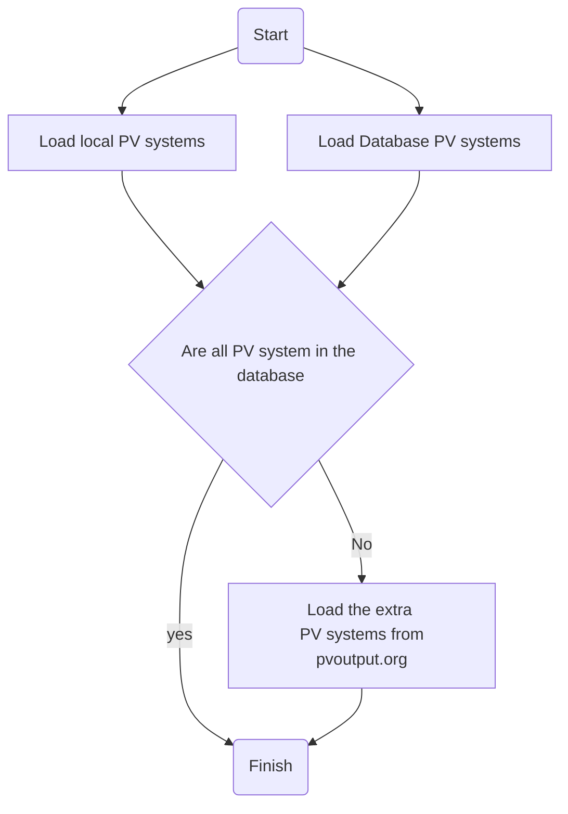
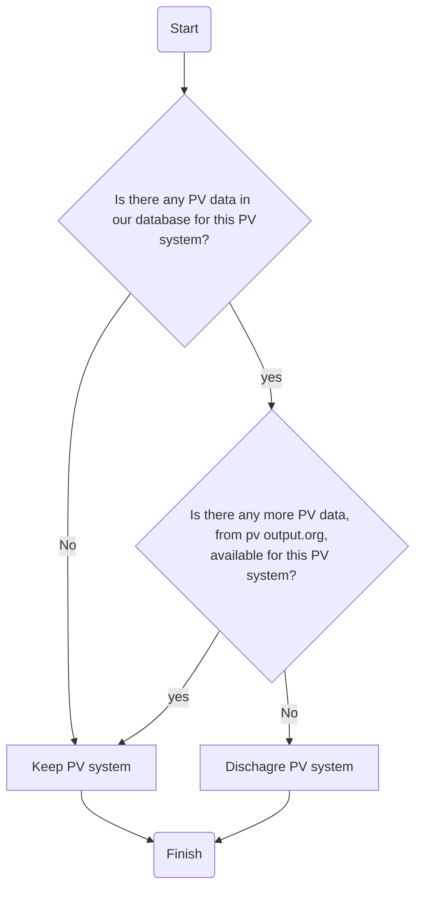
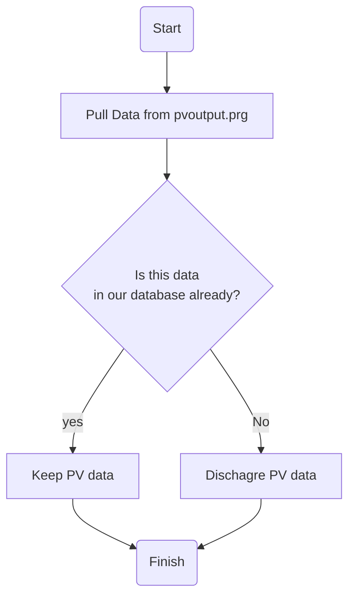

# PVConsumer

[](https://codecov.io/gh/openclimatefix/PVConsumer)

Consumer PV data from various sources


# Live

This application pull live data from PV output.org and stores it in our own database

To run the application locally
```bash
python pvconsumer/app.py
```

## Logic

The app has the following high-level strucuture


1. Get PV System


2. Filter PV Systems

3. Pull Data

## 🩺 Testing

Tests are run by using the following command
```bash
docker-compose -f test-docker-compose.yml run pvconsumer
```

These sets up `postgres` in a docker container and runs the tests in another docker container.
This slightly more complicated testing framework is needed (compared to running `pytest`)
as some queries can not be fully tested on a `sqlite` database

## Environmental Variables

- DB_URL: The database url which the forecasts will be saved too
- API_KEY: API key for pvoutput.org
- SYSTEM_ID: System id for pvoutput.org
- DATA_SERVICE_URL: data service url for pvoutput.org

