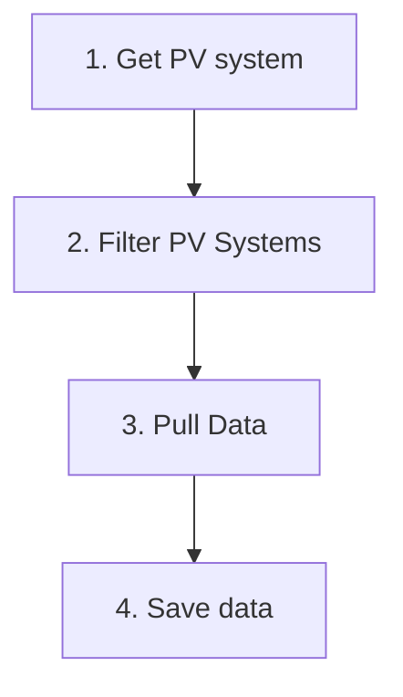
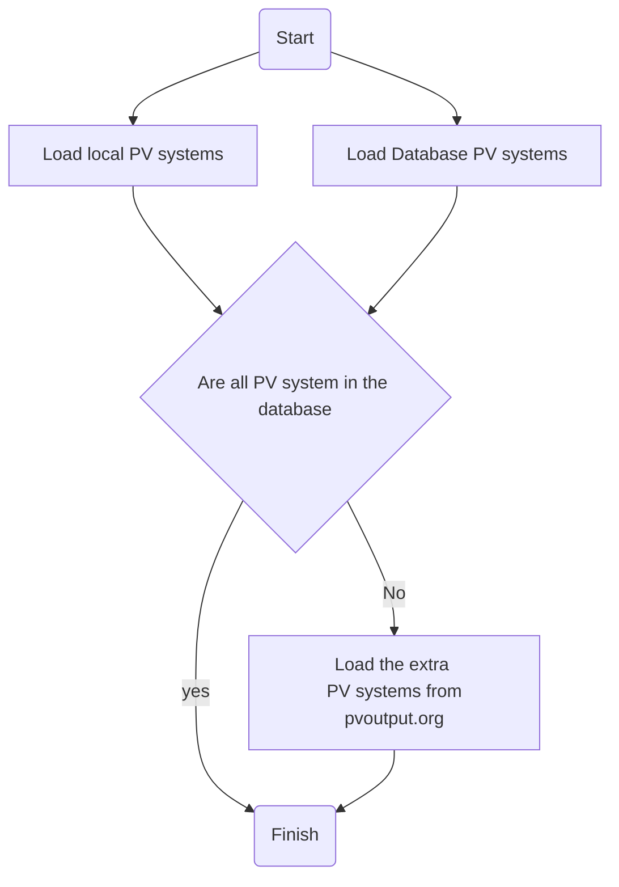
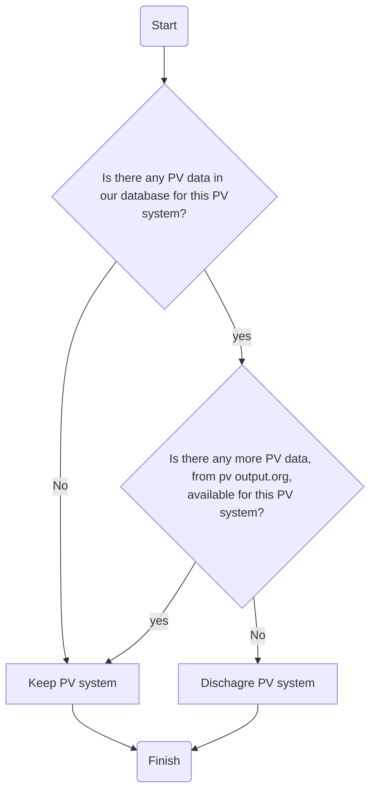
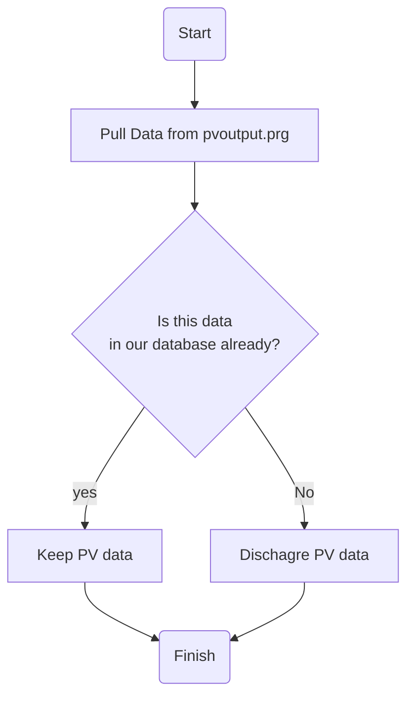

# PVConsumer

<!-- ALL-CONTRIBUTORS-BADGE:START - Do not remove or modify this section -->
[](#contributors-)
<!-- ALL-CONTRIBUTORS-BADGE:END -->

[](https://codecov.io/gh/openclimatefix/PVConsumer)

Consumer PV data from pvoutput.org. The idea is to expand to different data sources in the future.


# Live

This application pulls live data from PV output.org and stores it in a database

## Dependencies

* [poetry][poetry]

## Run locally

To run the application locally

```bash
# Install the python dependencies
poetry install

poetry run pvconsumer/app.py
```

## Logic

The app has the following high-level strucuture


1. Get PV System


2. Filter PV Systems

3. Pull Data


## Code style

Format the python codebase **in place**.

```bash
make format
```

Test that the codebase is formatted

```bash
make lint
```


## 🩺 Testing

Run only the unit tests

```bash
poetry run pytest tests/unittest
```

Run all the tests (including the "integration" tests that require credentials to call an external API)

```bash
poetry run pytest tests
```

## Environmental Variables

- DB_URL: The database url which the forecasts will be saved too
- API_KEY: API key for pvoutput.org
- SYSTEM_ID: System id for pvoutput.org
- DATA_SERVICE_URL: data service url for pvoutput.org
- DB_URL: Save in database to the pv database
- DB_URL_FORECAST: Let the database not that this service has run, `input_data_last_updatded` table
- DB_URL_PV_SITE: PV Site database

## Contributors ✨

Thanks goes to these wonderful people ([emoji key](https://allcontributors.org/docs/en/emoji-key)):

<!-- ALL-CONTRIBUTORS-LIST:START - Do not remove or modify this section -->
<!-- prettier-ignore-start -->
<!-- markdownlint-disable -->
<table>
  <tbody>
    <tr>
      <td align="center"><a href="http://lostcoding.com"><br /><sub><b>Brandon Ly</b></sub></a><br /><a href="https://github.com/openclimatefix/PVConsumer/commits?author=branberry" title="Code">💻</a></td>
    </tr>
  </tbody>
</table>

<!-- markdownlint-restore -->
<!-- prettier-ignore-end -->

<!-- ALL-CONTRIBUTORS-LIST:END -->

This project follows the [all-contributors](https://github.com/all-contributors/all-contributors) specification. Contributions of any kind welcome!

[poetry]: https://python-poetry.org/
